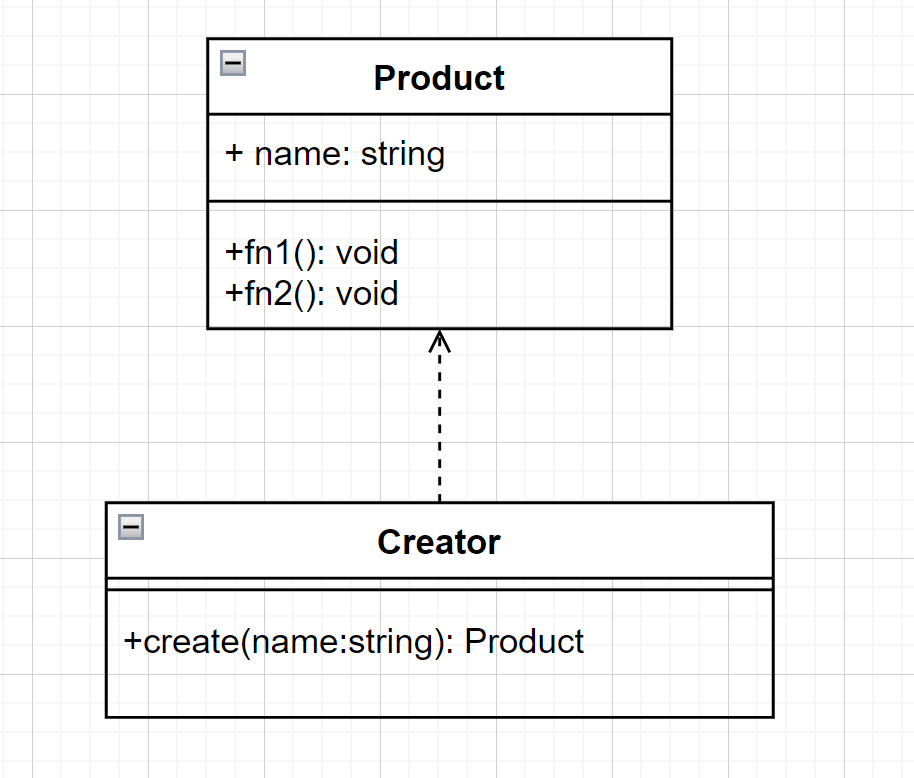
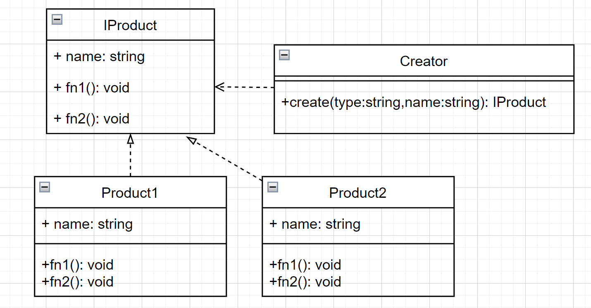

# 工厂模式

简单说：就是封装创建对象的逻辑，先看一个简易版的

## 简易版

代码

```js
// 类
class Product {
  name: string;
  constructor(name: string) {
    this.name = name;
  }

  fn1() {
    console.log('product fn1');
  }

  fn2() {
    console.log('product fn2');
  }
}

// 工厂
class Creator {
  create(name: string): Product {
    return new Product(name);
  }
}

// 测试
const creator = new Creator();
const p1 = creator.create('p1');
const p2 = creator.create('p2');
const p3 = creator.create('p3');
```

使用 UML 图表示



## 标准版

代码

```js
interface IProduct {
  name: string;
  fn1: () => void;
  fn2: () => void;
}

class Product1 implements IProduct {
  name: string;
  constructor(name: string) {
    this.name = name;
  }
  fn1() {
    console.log('product1 fn1');
  }
  fn2() {
    console.log('product1 fn2');
  }
}

class Product2 implements IProduct {
  name: string;
  constructor(name: string) {
    this.name = name;
  }
  fn1() {
    console.log('product2 fn1');
  }
  fn2() {
    console.log('product2 fn2');
  }
}

class Creator {
  // 依赖倒置原则
  create(type: string, name: string): IProduct {
    // New 的逻辑分装
    if (type === 'p1') {
      return new Product1(name);
    } else if (type === 'p2') {
      return new Product2(name);
    } else {
      throw new Error('Invalid type');
    }
  }
}

// 测试
const creator = new Creator();
const p1 = creator.create('p1', 'product1');
const p2 = creator.create('p2', 'product2');
```

使用 UML 图表示



## 使用场景

- JQuery 的 $ 函数

```js
// 扩展 window 的属性
declare interface Window {
  $: (selector: string) => JQuery;
}

class JQuery {
  selector: string;
  length: number;
  constructor(selector: string) {
    const domList = Array.prototype.slice.call(
      document.querySelectorAll(selector),
    );
    const length = domList.length;

    for (let i = 0; i < length; i++) {
      this[i] = domList[i];
    }
    this.selector = selector;
    this.length = length;
  }
  append(el: HTMLElement): JQuery {
    // append 的操作
    return this;
  }

  addClass(className: string): JQuery {
    // 添加 class 的操作
    return this;
  }
}

// 一般使用
const $div = new JQuery('div');

// 工厂模式
function $(selector: string) {
  return new JQuery(selector); // 逻辑分装
}
window.$ = $;

const $p = $('p');
```

- Vue \_createElementVNode 函数
- React createElement 函数
