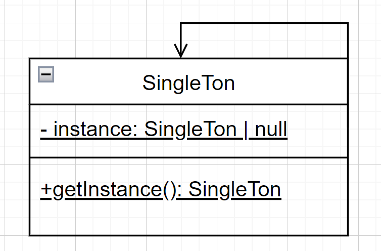

# 单例模式

特点

单例模式的核心是确保一个类只有一个实例，并提供全局访问点。

- 一个对象/实例只能被创建一次
- 创建之后缓存起来，以后继续使用
- 即，一个系统中只有一个实例

比如

以下是一些典型的单例模式应用场景，这些场景中多个实例会导致问题。

- 登录框，遮罩层，一个系统只有一个即可，多了无用
- Vuex Redux 的 store 对象，一个系统中只能有一个，多了会出错

## Typescript 实现

- 普通属性是实例属性/对象属性
- static 是静态属性

```ts
class SingleTon {
  name: string;

  // private 无法在外面 new 实例化
  private constructor(name: string) {
    this.name = name;
  }

  // private 无法在外面获取
  private static instance: SingleTon | null;

  // 获取单例
  static getInstance(name: string): SingleTon {
    if (this.instance === null) {
      this.instance = new SingleTon(name);
    }
    return this.instance; // 单例模式
  }
}

const s1 = SingleTon.getInstance('张三');
const s2 = SingleTon.getInstance('张三');
console.log(s1 === s2); // true

SingleTon.instance; // 会报错
const s3 = new SingleTon('张三'); // 报错
```

使用 UML 图表示



## Javascript 实现

1、使用闭包

```js
function genGetInstance() {
  let instance; // 闭包

  class Singleton {}

  return () => {
    if (instance == null) {
      instance = new Singleton();
    }
    return instance;
  };
}

const getInstance = genGetInstance();
const s1 = getInstance();
const s2 = getInstance();
console.log(s1 === s2); // true
```

2、使用模块化，比如

以下是一些典型的单例模式应用场景，这些场景中多个实例会导致问题。 genGetInstance.js 文件

- commonjs ES6 Module

```js
let instance;
class Singleton {}

export default () => {
  if (instance == null) {
    instance = new Singleton();
  }
  return instance;
};
```

## 使用场景

单例模式在实际开发中常用于需要全局唯一实例的场景，以下是几个例子。

- 登录框

```ts
class LoginForm {
  private state: string = 'hide'; // hide | show
  private constructor() {}

  show() {
    if (this.state === 'show') {
      console.log('已经显示了');
      return;
    }
    // ... 其他功能
    this.state = 'show';
  }
  hide() {
    if (this.state === 'hide') {
      console.log('已经隐藏了');
      return;
    }
    // ... 其他功能
    this.state = 'hide';
  }

  private static instance: LoginForm | null = null;

  static getInstance() {
    if (this.instance === null) {
      this.instance = new LoginForm();
    }
    return this.instance;
  }
}

const loginForm1 = LoginForm.getInstance();
const loginForm2 = LoginForm.getInstance();
console.log(loginForm1 === loginForm2); // true
```

- 自定义事件 EventBug 全局唯一
- Vuex Redux 的 store 全局唯一
- 实践中严格的单例模式应用不多，但单例的思想随处可见
