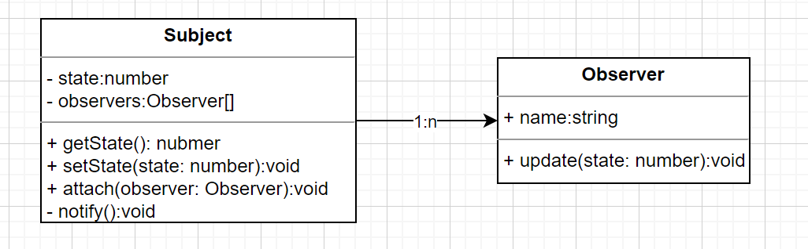
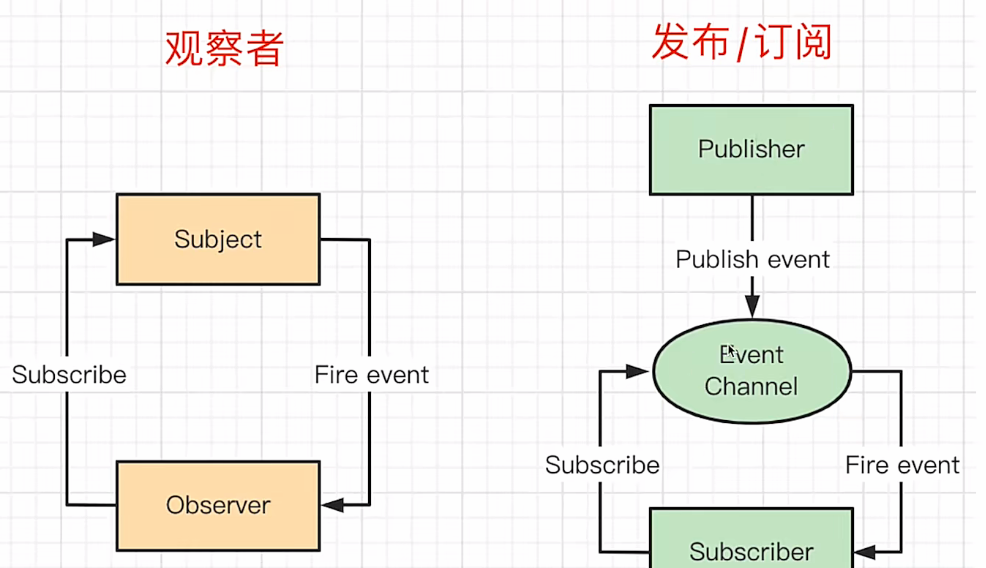

# 观察者模式

> 行为型模式

观察者模式定义了一种一对多的依赖关系，让多个观察者对象同时监听某一个主题对象。这个主题对象在状态上发生变化时，会通知所有观察者对象，使它们能够自动更新自己

## 观察者模式

代码

```ts
// 主题
class Subject {
  private state: number = 0;
  private observers: Observer[] = [];

  getState(): number {
    return this.state;
  }
  setState(state: number) {
    this.state = state;
    this.notify(); // 通知观察者
  }
  // 添加观察者
  attach(observer: Observer) {
    this.observers.push(observer);
  }

  private notify() {
    this.observers.forEach((observer) => observer.update(this.state));
  }
}

// 观察者
class Observer {
  name: string;
  constructor(name: string) {
    this.name = name;
  }
  update(state: number) {
    console.log(`${this.name} 收到通知，状态更新为 ${state}`);
  }
}

const sub = new Subject();
const obs1 = new Observer('观察者1');
const obs2 = new Observer('观察者2');
sub.attach(obs1);
sub.attach(obs2);

sub.setState(1);
```

使用 UML 图表示



### 使用场景

- DOM 事件

```js
const $btn = $('#btn');
$btn.click(() => {
  console.log('click');
});
```

- Vue React 组件生命周期

  > 查看 Vue 生命周期图 https://cn.vuejs.org/guide/essentials/lifecycle.html

- Vue watch
- Vue 组件更新过程
- 各种异步回调
  - 定时器 setTimeout setInterval
  - Promise.then
  - Nodejs - stream readline httpServer

```js
import { createReadStream } from 'fs';
import { resolve, dirname } from 'path';
import { fileURLToPath } from 'url';

const _dirname = dirname(fileURLToPath(import.meta.url));
const rs = createReadStream(resolve(_dirname, '../package-lock.json'));
// 读取流的数据的长度
let length = 0;
rs.on('data', (chunk) => {
  const len = chunk.toString().length;
  console.log(len);
  length += len;
});
rs.on('end', () => {
  console.log(length);
});
//===============================
import { createReadStream } from 'fs';
import { resolve, dirname } from 'path';
import { fileURLToPath } from 'url';
import { createInterface } from 'readline';

const _dirname = dirname(fileURLToPath(import.meta.url));
const rl = createInterface({
  input: createReadStream(resolve(_dirname, '../package-lock.json')),
});
// 读取文件的行数
let lineNum = 0;
rl.on('line', () => {
  lineNum++;
});
rl.on('close', () => {
  console.log(lineNum);
});
//================================
import http from 'http';

http
  .createServer((req, res) => {
    console.log(req.url);
    res.end('hello world');
  })
  .listen(8081);
console.log('server running at http://127.0.0.1:8081/');
```

- MutationObserver

```js
function callback(records, observer) {
  for (const record of records) {
    console.log('record', record);
  }
}
const observer = new MutationObserver(callback);
const el = document.getElementById('container');
if (el) {
  // 开始观察
  observer.observe(el, {
    attributes: true, // 观察属性变化
    attributeOldValue: true, // 记录属性变化前的值
    childList: true, // 观察子节点变化
    characterData: true, // 观察字符数据变化
    subtree: true, // 观察子孙节点变化
  });
}
// 停止观察
// observer.disconnect();
```

## 发布订阅模式

不属于传统的观察者模式，是观察者模式的变体

```js
// 绑定事件
event.on('eventName', () => {});
// 触发执行
event.emit('eventName');
```

- 观察者：Subject 和 Observer 直接绑定（回调函数），中间无媒介
- 发布订阅：Publisher 和 Observer 互不认识，中间有媒介（事件中心），需要手动触发（emit）



### 使用场景

- 自定义事件（Vue2 的 EventBus，Vue3 的 mitt，老牌的eventEmitter）
  - 需要及时 off，避免内存泄漏
- postMessage 通讯
  - 网页和 iframe 通讯
  - 其他：多进程（nodejs WebWorker）通讯，WebSocket 通讯

```html
<iframe src="./iframe.html" id="iframe1"></iframe>
<script>
  // main.html
  window.addEventListener('message', (e) => {
    console.log(e.data);
  });
</script>
<script>
  // iframe.html
  window.parent.postMessage('来自iframe的消息', '*');
</script>
```
