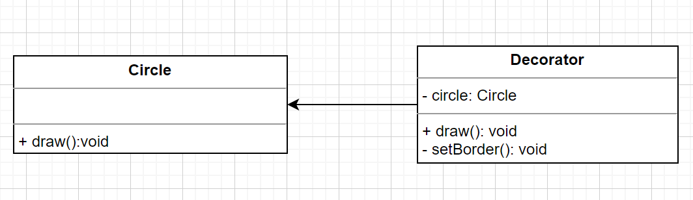

# 装饰器模式

> 行为型模式

特点

- 针对一个对象
- 动态的添加新功能
- 但不改变它原有的功能

## 基本使用

代码

```ts
class Circle {
  draw() {
    console.log('画圆');
  }
}

class Decorator {
  private circle: Circle;

  constructor(circle: Circle) {
    this.circle = circle;
  }

  draw() {
    this.circle.draw(); // 原有功能
    this.setBorder(); // 装饰
  }

  private setBorder() {
    console.log('设置边框');
  }
}

const circle = new Circle();
const decorator = new Decorator(circle);
decorator.draw();
```

使用 UML 图表示



## 使用场景

> 建议使用 bun 运行 ts 代码

- 装饰 class

```ts
// 装饰器函数
// function testable(target: any) {
//   target.isTestable = true;
// }

// 装饰器的工厂函数（工厂模式思想）
function testable(val: boolean) {
  return function (target: any) {
    target.isTestable = val;
  };
}

@testable(false)
class Foo {
  static isTestable?: boolean;
}

console.log(Foo.isTestable);
```

- 装饰 method

```ts
/**
 * 只读装饰器
 * @param target 实例
 * @param key key
 * @param descriptor 属性描述符
 */
function readOnly(target: any, key: string, descriptor: PropertyDescriptor) {
  descriptor.writable = false;
}

function configurable(val: boolean) {
  return function (target: any, key: string, descriptor: PropertyDescriptor) {
    descriptor.configurable = val;
  };
}

class Foo {
  private name = '张三';
  private age = 18;

  @readOnly
  getName() {
    return this.name;
  }

  @configurable(false)
  getAge() {
    return this.age;
  }
}

const foo = new Foo();

// 直接报错了
foo.getName = () => {
  console.log('修改了');
};

/* {
  value: [Function: getAge],
  writable: true,
  enumerable: false,
  configurable: false,
}*/
console.log(Object.getOwnPropertyDescriptor(foo.__proto__, 'getAge'));
```

## AOP

- Aspect Oriented Program 面向切面编程
- 业务和系统基础功能分离，和 Decorator 很配
- AOP 和 OOP 并不冲突，主要用于日志、事务、缓存、权限、性能监控等

普通写法

```ts
// 普通写法
function log1() {
  console.log('记录日志');
}

class Foo1 {
  fn() {
    log1();
    console.log('业务功能-点赞');
  }
}
const foo1 = new Foo1();
console.log(foo1.fn());
```

装饰器写法

```ts
// 装饰器写法
function log2(
  target: any,
  propertyKey: string,
  descriptor: PropertyDescriptor,
) {
  const oldMethod = descriptor.value; // 保存原有 fn 方法

  // 重写 Foo2.fn 方法
  descriptor.value = function () {
    console.log('记录日志');
    return oldMethod.apply(this, arguments);
  };

  return descriptor;
}

class Foo2 {
  @log2
  fn() {
    console.log('业务功能-点赞');
  }
}

const foo2 = new Foo2();
console.log(foo2.fn());
```
