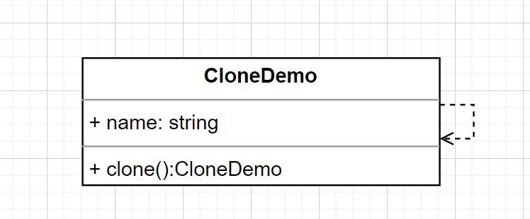
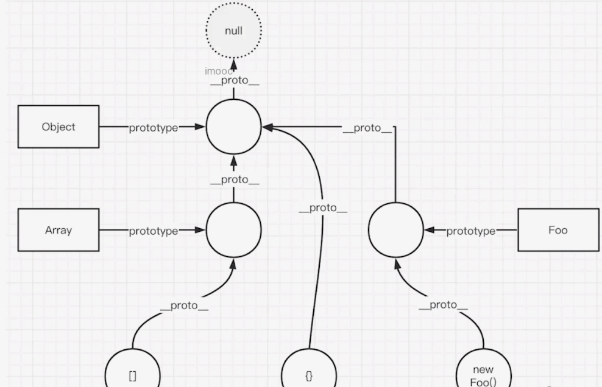

# 原型模式

> 创建型模式，这里并非标准的原型模式，主要讲原型和原型链，及对象属性描述符

特点

原型模式的核心在于通过克隆现有对象来创建新对象，避免重复初始化。

- 原型模式在实际开发中较少直接使用，但原型链是 JavaScript 的基础
- 属性描述符不常用，但它是理解对象属性的重要基础

## 标准原型模式

代码

```ts
class CloneDemo {
  name = 'clone demo';
  clone(): CloneDemo {
    return new CloneDemo();
  }
}
```

使用 UML 图表示



## 原型 & 原型链

原型链是 JavaScript 实现继承的基础机制，通过原型链可以实现属性和方法的共享。

### 原型

- 函数（class）都有显示原型 prototype
- 对象都有隐式原型 `__proto__`（也可以写出`[[Prototype]]`）
- 对象 `__proto__`（也可以写出`[[Prototype]]`） 指向构造函数的 prototype

```ts
const obj = {};
console.log(obj.__proto__ === Object.prototype); // true

const arr = [];
console.log(arr.__proto__ === Array.prototype); // true

function Person() {}
const person = new Person(); // Person 是构造函数
console.log(person.__proto__ === Person.prototype); // true
```

### 原型链

- 对象 `Object.prototype.__proto__` 指向 null

```ts
console.log(Object.prototype.__proto__); // null
```

继承



### 使用场景

- 用 Object.create() 修改对象的 `__proto__` 的指向

```ts
const obj1 = {};
console.log(obj1.__proto__); // [Object: null prototype] {}

const obj2 = Object.create({});
console.log(obj2.__proto__); // {}

const obj3 = Object.create(null);
console.log(obj3.__proto__); // undefined
```

## 对象属性描述符

属性描述符是控制对象属性行为的关键，通过它可以精确控制属性的可读性、可写性和可枚举性。

### 获取和设置

- 获取 Object.getOwnPropertyDescriptor
- 设置 Object.defineProperty

```ts
const obj = { x: 100 };
// 获取属性描述符
console.log(Object.getOwnPropertyDescriptor(obj, 'x')); // { value: 100, writable: true, enumerable: true, configurable: true }
// 修改属性描述符
Object.defineProperty(obj, 'x', {
  writable: false,
  enumerable: false,
});

console.log(Object.getOwnPropertyDescriptor(obj, 'x')); // { value: 100, writable: false, enumerable: false, configurable: true }
```

### 有哪些属性描述符

- value
  - 定义属性值
  - 没有 value 时，则看不到对象属性
  - 但可以通过 get set 来操作属性值

```ts
const obj = { x: 100 };

let y = 200;
Object.defineProperty(obj, 'y', {
  get() {
    return y;
  },
  set(value) {
    y = value;
  },
});
console.log(obj.y); // 200
obj.y = 300;
console.log(obj.y); // 300
console.log(Object.getOwnPropertyDescriptor(obj, 'y')); // { get: [Function: get], set: [Function: set], enumerable: false, configurable: true }
```

- configurable
  - 是否可以 delete 删除，并重新定义
  - 是否可以修改其他属性描述
  - 是否可以修改 get set

```ts
const obj = { x: 100 };

Object.defineProperty(obj, 'y', {
  value: 200,
  configurable: false,
});
console.log(Object.getOwnPropertyDescriptor(obj, 'y')); // { value: 200, configurable: false, writable: false, enumerable: false }
console.log(delete obj.y); // false
console.log((obj.y = 100)); // 报错
```

- writable
  - 属性值是否可以被修改
  - 对比 Object.freeze() 冻结：现有属性不可被修改，新属性不可被添加；使用 Object.isFrozen()
  - 对比 Object.seal() 密封：现有属性可以被修改，新属性不可被添加；使用 Object.isSealed()

```ts
const obj = Object.freeze({ x: 100 });
obj.x = 200; // 报错了
obj.y = 200; // 报错了
console.log(Object.getOwnPropertyDescriptor(obj, 'x')); // { value: 100, writable: false, enumerable: true, configurable: false }

const obj = Object.seal({ x: 100 });
obj.x = 200; //
obj.y = 200; // 报错了
console.log(Object.getOwnPropertyDescriptor(obj, 'x')); // { value: 200, writable: true, enumerable: true, configurable: false }
```

- enumerable
  - 是否可以 for...in 遍历：现在已经不需要 Object.hasOwnProperty() 来判断了
  - 对比 for...of 迭代器

```js
const obj = {
  x: 10,
  y: 20,
  z: 30,
};
Object.defineProperty(obj, 'x', {
  enumerable: false,
});
// 打印出 y z
for (const key in obj) {
  console.log(key);
}
```

### 遍历 Symbol 属性

- 使用 Object.getOwnPropertySymbols() 获取
- 使用 Reflect.ownKeys() 获取

```ts
const obj = {
  x: 10,
  [Symbol('y')]: 20,
};

console.log(Object.keys(obj)); // [ 'x' ]
console.log(Object.getOwnPropertySymbols(obj)); // [ Symbol(y) ]
console.log(Reflect.ownKeys(obj)); // [ 'x', Symbol(y) ]
```
