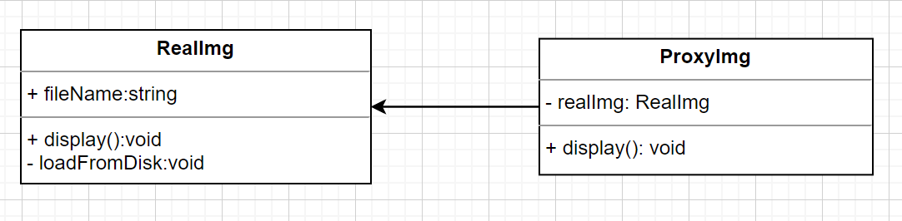

# 代理模式

> 结构型模式

特点

- 针对一个对象
- 设置代理，控制这个对象的访问
- 用户不得直接访问对象，而要通过代理
- 对比装饰器模式，装饰器不可以改变原有对象的功能，而代理可以

## 基本使用

代码

```ts
class RealImg {
  fileName: string;
  constructor(fileName: string) {
    this.fileName = fileName;
  }

  display() {
    this.loadFromDisk();
    console.log(`display... ${this.fileName}`);
  }

  private loadFromDisk() {
    console.log(`loading... ${this.fileName}`);
  }
}

class ProxyImg {
  private realImg: RealImg;

  constructor(fileName: string) {
    this.realImg = new RealImg(fileName);
  }

  // 代理
  display() {
    // 这里可以做一些其他的操作，比如缓存，权限校验等
    this.realImg.display();
  }
}

const proxyImg = new ProxyImg('xxx.png');
/*
loading... xxx.png
display... xxx.png
*/
proxyImg.display();
```

使用 UML 图表示



## 使用场景

### DOM 事件代理（委托）

- 事件绑定到父容器上，而非目标节点
- 适合目标较多或数量不确定（如无限加载的瀑布流图片列表）

```html
<div id="container">
  <a href="#">1</a>
  <a href="#">2</a>
  <a href="#">3</a>
  <a href="#">4</a>
</div>
<script>
  const container = document.getElementById('container');
  container.addEventListener('click', (e) => {
    if (e.target.tagName === 'A') {
      alert(e.target.textContent);
    }
  });
</script>
```

### Webpack devSever proxy

- 开发环境，前端请求服务端 API
- 代理到本地服务器，或者 mock 接口
- 正向代理，客户端代理

```js
devServer: {
  port: 8080,
  proxy: {
    '/api': {
      target: 'http://localhost:3000',
      changeOrigin: true,
      pathRewrite: { '^/api': '' }
    }
  }
}
```

### Nginx 反向代理

- 对比正向代理，反向代理是服务端代理

```nginx
server {
    listen 80;
    location / {
        proxy_pass http://localhost:3000;
    }
    location /api {
        proxy_pass http://localhost:3001;
        proxy_set_header Host $host;
    }
}
```

## Proxy 应用

模拟明星&经纪人

```ts
// 明星
const star = {
  name: '张三',
  age: 20,
  phone: '13111111111',
  price: 0.0, // 明星不谈钱
};
// 经纪人
const agent = new Proxy(star, {
  get(target, key) {
    if (key === 'phone') {
      return '13122222222'; // 经纪人的电话，明星电话保密
    }
    return Reflect.get(target, key);
  },
  set(target, key, val) {
    if (key === 'price') {
      if (val < 10 * 10000) {
        throw new Error('价格太低');
      } else {
        console.log('合作成功');
        return Reflect.set(target, key, val);
      }
    }
    return false;
  },
});

console.log(agent.phone); // 13122222222

// error: 价格太低
agent.price = 10;
agent.price = 100000; // 合作成功
```

### 使用场景

- 跟踪属性

```ts
const user = {
  name: '张三',
};

const proxy = new Proxy(user, {
  get(target, key) {
    console.log(`get...`); // 监听
    return Reflect.get(target, key);
  },
  set(target, key, val) {
    console.log(`set...`); // 监听
    return Reflect.set(target, key, val);
  },
});
proxy.name = '李四';
proxy.name;
```

- 隐藏属性

```ts
const user = {
  name: '张三',
  age: 18,
};
const hiddenFields = ['age'];

const proxy = new Proxy(user, {
  get(target, key) {
    if (hiddenFields.includes(key as string)) {
      return undefined;
    }
    return Reflect.get(target, key);
  },
  set(target, key, val) {
    if (hiddenFields.includes(key as string)) {
      return false;
    }
    return Reflect.set(target, key, val);
  },
  has(target, key) {
    if (hiddenFields.includes(key as string)) {
      return false;
    }
    return Reflect.has(target, key);
  },
});

proxy.age = 10; // 报错
console.log(proxy.age); // undefined
console.log(proxy.hasOwnProperty('age')); // false
```

- 验证属性

```ts
const user = {
  name: '张三',
  age: 18,
};

const proxy = new Proxy(user, {
  set(target, key, val) {
    if (key === 'age' && typeof val !== 'number') {
      throw new Error('年龄必须是数字');
    }
    return Reflect.set(target, key, val);
  },
});

proxy.age = '10'; // error: 年龄必须是数字
```

- 记录实例

```ts
const userList = new Set();
class User {
  name: string;
  constructor(name: string) {
    this.name = name;
  }
}

const ProxyUser = new Proxy(User, {
  construct(...args) {
    const user = Reflect.construct(...args);
    userList.add(user); // 记录实例
    return user; // 返回实例
  },
});

const user1 = new ProxyUser('张三');
const user2 = new ProxyUser('李四');
/*
Set(2) {
  User {
    name: "张三",
  },
  User {
    name: "李四",
  },
}
*/
console.log(userList);
```

### 可能遇到的坑

- 捕获器不变式
  > 比如：原有的属性描述符不可改变

```ts
const obj = {
  x: 100,
  y: 0,
};
Object.defineProperty(obj, 'y', {
  value: 200,
  writable: false,
  configurable: false,
});

const proxy = new Proxy(obj, {
  get() {
    return 'abc';
  },
});

console.log(proxy.x); // abc
// 原有的属性描述符不可改变
console.log(proxy.y); // TypeError: Proxy handler's 'get' result of a non-configurable and non-writable property should be the same value as the target's property
```

- 关于 this
  > this 指向的是代理对象，而不是目标对象

```ts
const user = {
  name: '张三',
  getName() {
    console.log('this', this);
    return this.name;
  },
};

const proxy = new Proxy(user, {});
user.getName(); //  this => user
proxy.getName(); // this => Proxy
```
