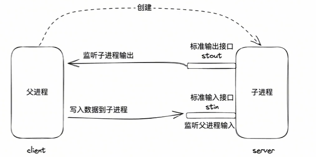
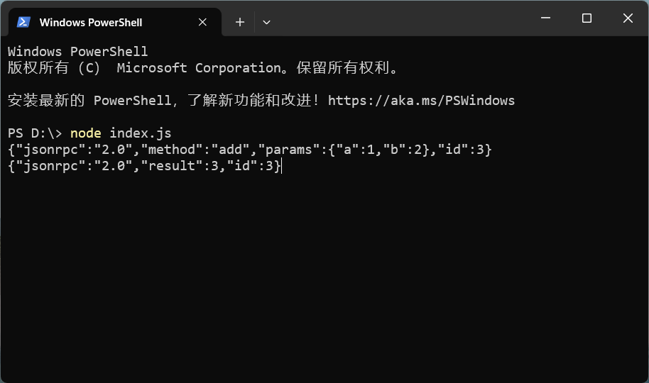
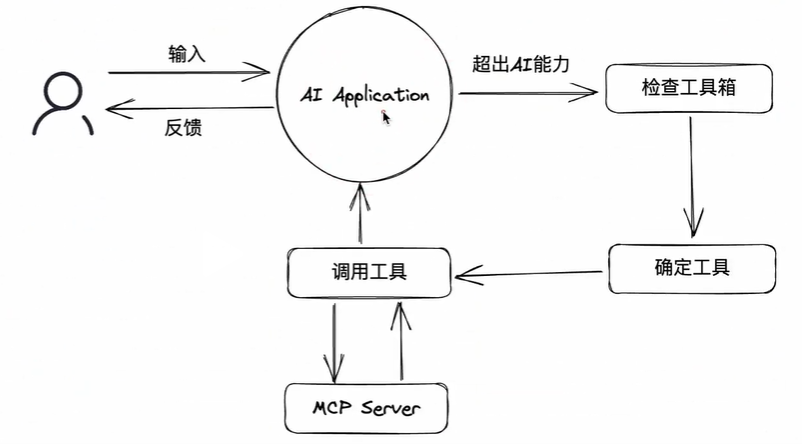
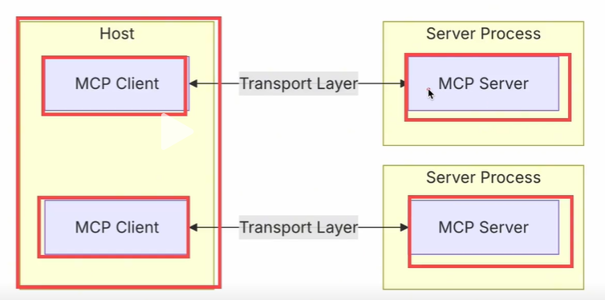

# MCP 入门笔记

在学习 MCP 之前，先了解一些其他知识，这里用一个实现加法的例子来对比实现

- 开发工具：VSCode v1.103.2
- 开发环境：Node.js v18.20.0

一个加法函数

```js
function add({ a, b }) {
  return a + b;
}
console.log(add({ a: 2, b: 3 }));
```

很轻松就知道上面的代码会输出 `5`，下面来了解下使用 MCP 相关知识的方式实现

## 前置知识

[MCP 基本协议](https://modelcontextprotocol.io/specification/2025-06-18/basic) 相关知识

### 通信方式：stdio

stdio：standard input and output 标准输入输出，比如 node.js 代码：

输出

```js
process.stdout.write('hello world !!\n');
```

使用 `node test.js` 运行上面的代码，会在终端输出 `hello world !!`

输入/输出

```js
process.stdin.setEncoding('utf-8');
process.stdin.on('data', (chunk) => {
  process.stdout.write(`hello ${chunk}`);
});
```

使用 `node test.js` 运行上面的代码，在终端输入`xxx`，会输出 `hello xxx`



### 通信格式：JSON-RPC

基于 json 格式的 RPC 远程过程调用协议。使用这样方式来实现上面的加法功能

```js
process.stdin.setEncoding('utf-8');

const funcs = {
  add({ a, b }) {
    return a + b;
  },
};

process.stdin.on('data', (chunk) => {
  const req = JSON.parse(chunk);
  const func = req.method;
  const params = req.params;
  const result = funcs[func](params);
  const res = {
    jsonrpc: '2.0',
    result,
    id: req.id,
  };
  process.stdout.write(JSON.stringify(res));
});
```

request 请求

```js
{"jsonrpc":"2.0","method":"add","params":{"a":1,"b":2},"id":3}
```

response 响应

```js
{"jsonrpc":"2.0","result":3,"id":3}
```



## 进入 MCP

MCP 是一套标准协议，它规定了应用程序之间如何通信

- 通信方式，stdio: 推荐，高效、简洁、本地；http：可远程
- 通信格式：基于 JSON-RPC 的进一步规范

基本规范

- 初始化 initialize, 发送请求 request, 接收响应 response
  https://modelcontextprotocol.io/specification/2025-06-18/basic/lifecycle#initialization
- 工具发现 tools/list，服务器有哪些工具可以给客户端使用
  https://modelcontextprotocol.io/specification/2025-06-18/server/tools#listing-tools
- 工具调用 tools/call，客户端调用服务器的工具
  https://modelcontextprotocol.io/specification/2025-06-18/server/tools#calling-tools

### SDK 和 调试工具

- MCP SDK，使用 `@modelcontextprotocol/sdk` 更方便开发 `MCP Server`

```sh
npm i @modelcontextprotocol/sdk
```

使用 sdk 的方式实现上面的加法功能，也是 [sdk 文档](https://www.npmjs.com/package/@modelcontextprotocol/sdk#quick-start)上的一个例子，然后使用调试工具来调试，在 src/demo/mcp-server.js 添加以下代码

```js
import {
  McpServer,
  ResourceTemplate,
} from '@modelcontextprotocol/sdk/server/mcp.js';
import { StdioServerTransport } from '@modelcontextprotocol/sdk/server/stdio.js';
import { z } from 'zod';

// Create an MCP server
const server = new McpServer({
  name: 'mcp-server',
  version: '1.0.0',
});

// Add an addition tool
server.registerTool(
  'add',
  {
    title: '加法',
    description: '两个数相加',
    inputSchema: { a: z.number(), b: z.number() },
  },
  async ({ a, b }) => ({
    content: [{ type: 'text', text: String(a + b) }],
  }),
);

// Add a dynamic greeting resource
server.registerResource(
  'greeting',
  new ResourceTemplate('greeting://{name}', { list: undefined }),
  {
    title: '请求资源', // Display name for UI
    description: '动态请求生成器',
  },
  async (uri, { name }) => ({
    contents: [
      {
        uri: uri.href,
        text: `Hello, ${name}!`,
      },
    ],
  }),
);

// Start receiving messages on stdin and sending messages on stdout
const transport = new StdioServerTransport();
await server.connect(transport);
```

- MCP Server 的调试工具，直接运行下面的命令，会自动打开浏览器

```sh
npx @modelcontextprotocol/inspector
```


## 对接 AI 应用程序

所有能与大模型交互的应用都可以看作是 AI 应用程序，比如

- ChatGPT 是 AI 应用，而大模型是 GPT
- DeepSeek 也是类似，DeepSeek 网页是 AI 应用，而大模型是 DeepSeek-V3.1，DeepSeek-R1...
  ...

这里需要一个支持 MCP 协议的 AI 应用程序，比如 VSCode 添加本地 MCP Server，在 .vscode/mcp.json 中配置

```js
{
	"servers": {
		"mcp-server": {
			"type": "stdio",
			"command": "node",
			"args": [
				"src/demo/mcp-server.js"
			]
		}
	},
	"inputs": []
}
```



两个核心概念

- MCP Host：指定是 AI 应用本身，用于发现 MCP Server 以及其中的工具列表
- MCP Client：用于和 MCP Server 通信的客户端，往往在 Host 内部开启，通常情况下，每启动一个 MCP Server，就会开启一个 MCP Client



现在可以在 VSCode 中调用 MCP Server 的工具了，比如调用 add 工具

## MCP 总结

MCP，全称 Model Context Protocol，模型上下文协议。其旨在为 AI 与外部程序之间建立通信标准，从而使得外部程序可以被部署到任意 AI，也使得 AI 应用可以使用任意外部程序。
