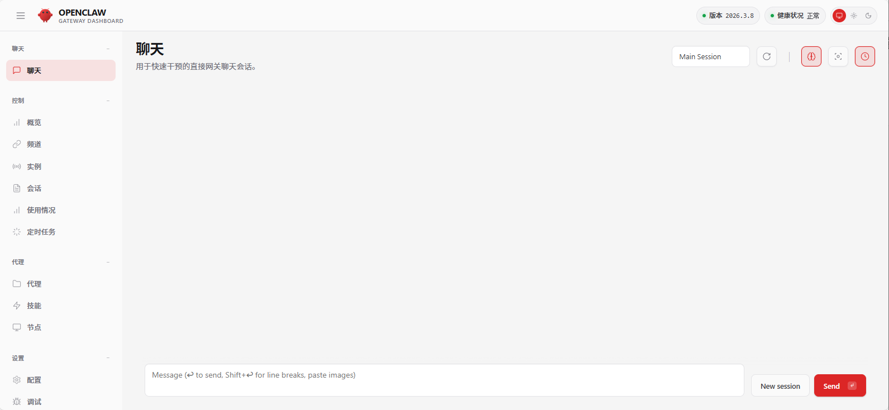
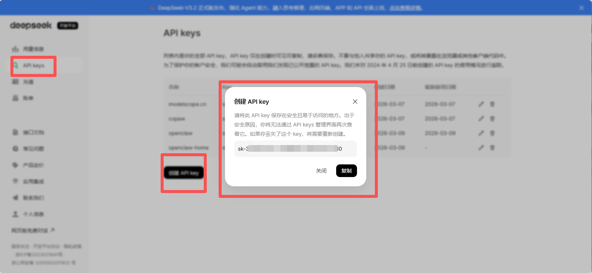
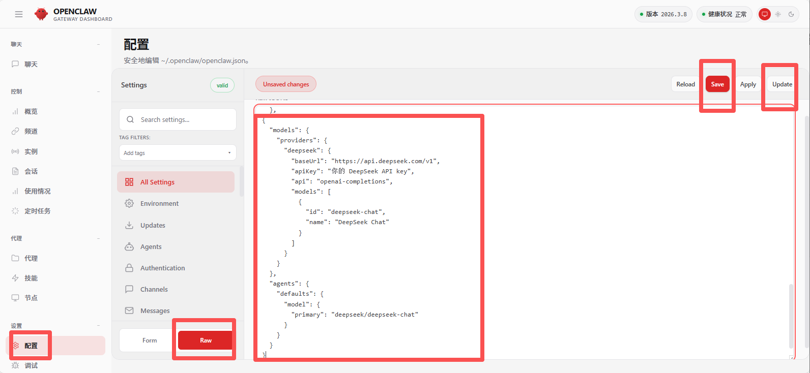
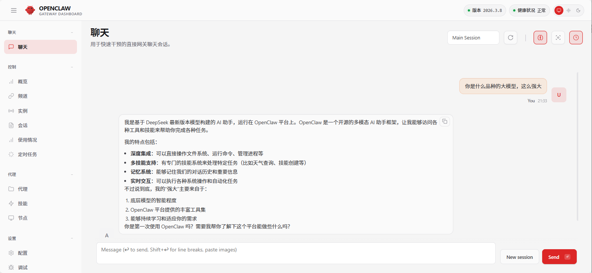

# WSL 环境下安装 OpenClaw 并接入deepseek

1、 环境

- window下的 wsl 环境（Ubuntu 22.04.5 LTS）
- Node v22.20.0

安装

curl -fsSL https://openclaw.ai/install.sh | bash

安装完成后进入 OpenClaw onboarding 引导

> I understand this is personal-by-default and shared/multi-user use requires lock-down. Continue?
> yes

> Onboarding mode
> QuickStart

> Model/auth provider
> Skip for now

> Filter models by provider
> All providers

> Default model
> Keep curren

> Select channel (QuickStart)
> Skip for now

> Search provider
> Skip for now

> Configure skills now? (recommended)
> No

> Enable hooks?
> 空格选中选项，然后Enter回车

> How do you want to hatch your bot?
> Do this later

执行以上步骤后，引导配置完成

2、启动 Web 控制台

openclaw dashboard

在浏览器中打开 `http://localhost:18789/#token=a77704090cc77b5fcc5fbb4f5738b693c33203bbabec823b`（记得带上 token参数）



3、接入 deepseek

首先得有 deepseek 的开放平台 https://platform.deepseek.com/api_keys 申请 API key



然后配置 OpenClaw 的模型 deepseek

```
{
  "models": {
    "providers": {
      "deepseek": {
        "baseUrl": "https://api.deepseek.com/v1",
        "apiKey": "你的 DeepSeek API key",
        "api": "openai-completions",
        "models": [
          {
            "id": "deepseek-chat",
            "name": "DeepSeek Chat"
          }
        ]
      }
    }
  },
  "agents": {
    "defaults": {
      "model": {
        "primary": "deepseek/deepseek-chat"
      }
    }
  }
}
```

最后点击 Update 重启配置


最后测试一下，“你是什么品种的大模型，这么强大”


这样一个能干活的 AI 助手就跑起来了，具体能干些啥得发挥想象力
